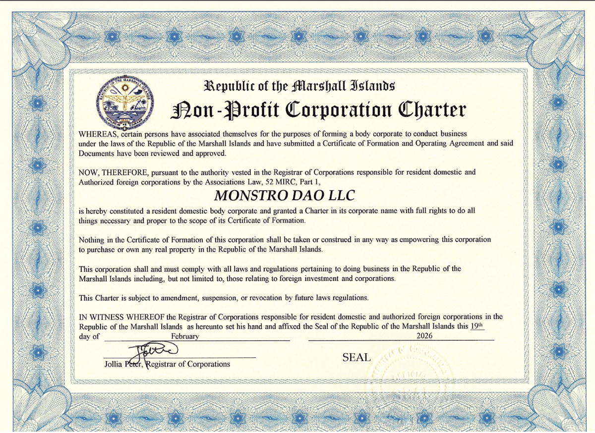
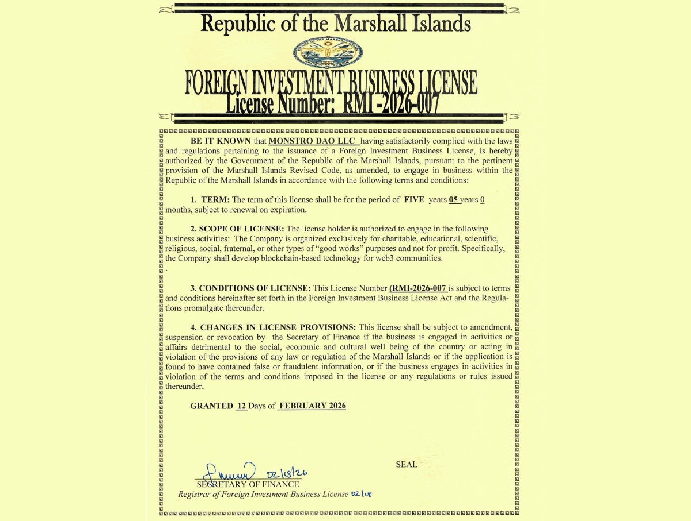

# DAO Legal Structure

Monstro DAO operates through a formally registered legal wrapper in the Republic of the Marshall Islands.

This structure provides jurisdictional clarity, operational continuity, and long-term governance stability while preserving decentralized control of the protocol.

***

## Entity Details

**Legal Name:** MONSTRO DAO LLC\
**MIDAO Registration Number:** 10247-26\
**Registered Address:**\
852 Long Island Rd\
Majuro, MH 96960\
Republic of the Marshall Islands

***

## Corporate Charter

The Corporate Charter formally establishes Monstro DAO LLC as a resident domestic entity under the laws of the Republic of the Marshall Islands.

<figure><figcaption></figcaption></figure>

***

## Foreign Investment Business License

The Foreign Investment Business License authorizes Monstro DAO LLC to operate and engage in blockchain-based development activities within the Republic of the Marshall Islands.

License Number: **RMI-2026-007**\
Term: Five (5) years

<figure><figcaption></figcaption></figure>

***

## Governance Documentation

The DAO’s Operating Agreement and internal governance documents define Council authority, treasury management structure, and operational boundaries between the DAO and Monstro Labs.

These documents are maintained privately and inform the ongoing rollout of on-chain governance infrastructure.
