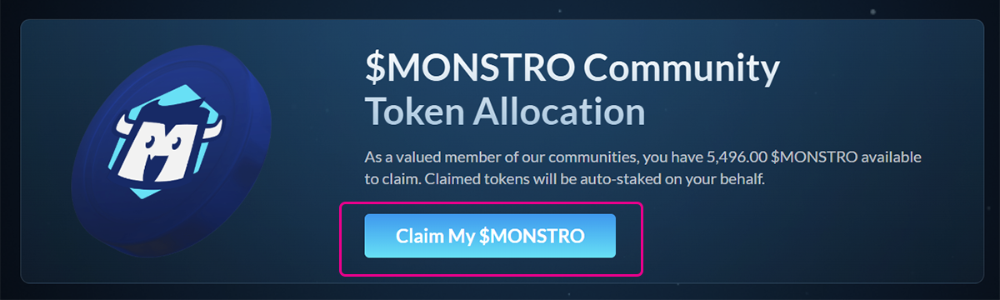
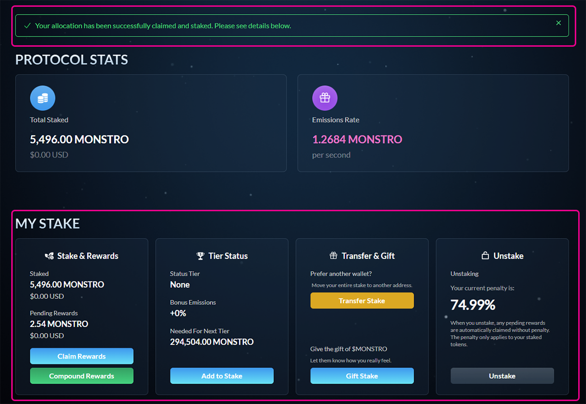

# Claiming Your Allocation

## Step 1: Open the Claim page

Connect your wallet, then go to:\
[https://monstrodefi.com/claim](https://monstrodefi.com/claim)

This page will display your available **$MONSTRO** allocation, if eligible.

***

## Step 2: Claim your allocation

Click **Claim My $MONSTRO** to begin the claim process.

Your wallet will prompt you to confirm the transaction. A small amount of **ETH on Base** is required to cover gas fees.

Once confirmed, your allocation will be **automatically staked** on your behalf. There is no separate staking step required.

<figure><figcaption></figcaption></figure>

***

## Step 3: View your stake

After the transaction is complete, you will be redirected to the **Staking** page.

You will see a confirmation message at the top of the page, along with your staked balance and rewards details below.

<figure><figcaption></figcaption></figure>

***

## Closing note

If the transaction is successful, your tokens are safely staked and earning rewards immediately. You can manage your stake, claim rewards, or add more tokens from the staking page at any time.
