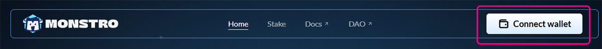
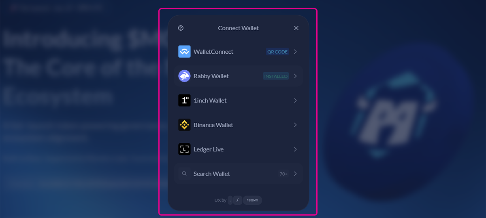
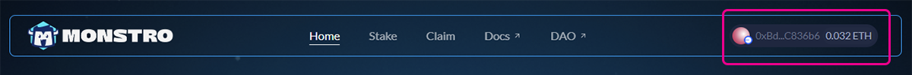

# Connecting Your Wallet

## Step 1: Open Monstro in your browser

Navigate to the Monstro website. If your wallet is not connected yet, you will see a **Connect wallet** button in the top-right corner of the page.

<figure><figcaption></figcaption></figure>

***

## Step 2: Choose your wallet

Click **Connect wallet** to open the wallet selection modal. Choose the wallet you normally use, such as MetaMask, Rabby, WalletConnect, Ledger Live, or another supported option.

Follow the prompts in your wallet to approve the connection.

<figure><figcaption></figcaption></figure>

***

## Step 3: Confirm you are connected

Once connected, your wallet address and balance will appear in the top-right corner. This confirms your wallet is successfully connected and ready to use.

<figure><figcaption></figcaption></figure>

***

## Closing note

If you ever need to switch wallets or disconnect, click your wallet address in the top-right corner and follow the options shown.
