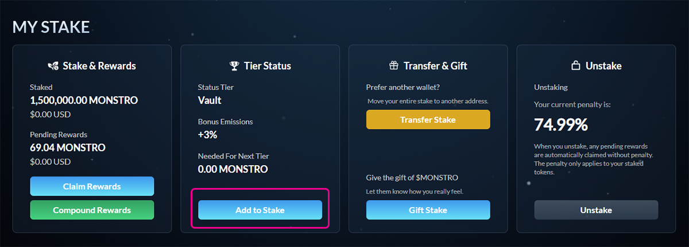
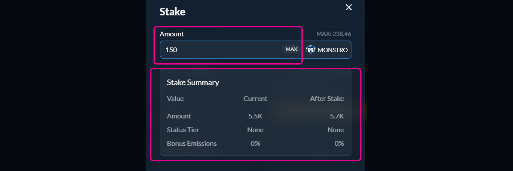
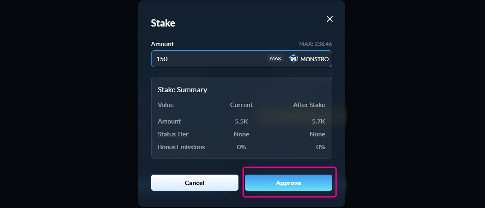
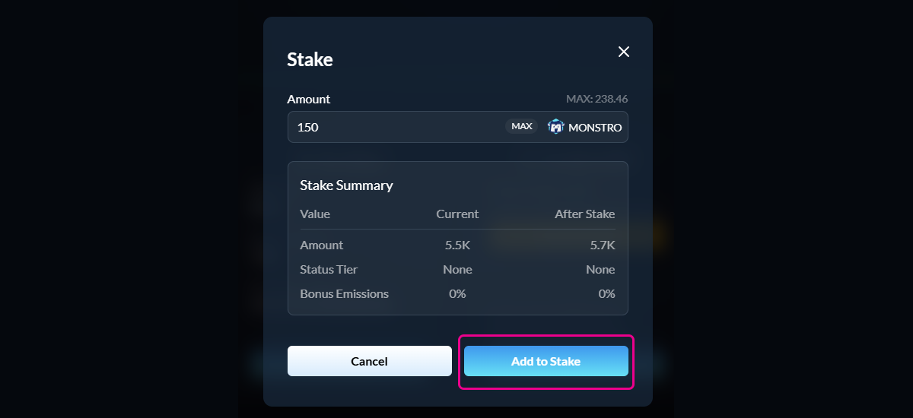
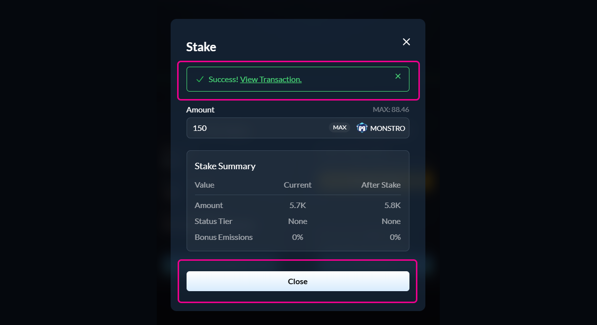

# Adding to Your Stake

## Step 1: Open the Stake page

Navigate to the **Stake** page and locate the **My Stake** section.

Click **Add to Stake** to increase your existing stake.

<figure><figcaption></figcaption></figure>

***

## Step 2: Enter the amount to add

The staking modal will open. Enter the amount of $MONSTRO you want to add to your current stake.

The stake summary will update automatically to show:

* Your new total staked amount
* Your tier status after adding
* Any bonus emissions you may unlock

<figure><figcaption></figcaption></figure>

***

## Step 3: Approve $MONSTRO (if required)

If this is your first time staking, or if you have not previously approved $MONSTRO for staking, you will be asked to approve the token.\
\
This approval allows the staking contract to access your $MONSTRO. It does not stake any tokens and only needs to be repeated if the approval is revoked.

Confirm the approval transaction in your wallet and wait for it to complete.

<figure><figcaption></figcaption></figure>

***

## Step 4: Add to your stake

Once approval is complete, the button will change to **Add to Stake**.

Click **Add to Stake** and confirm the transaction in your wallet.

<figure><figcaption></figcaption></figure>

***

## Step 5: Confirm success

After the transaction is confirmed, you will see a success message and your updated stake totals.

Your added tokens immediately begin earning rewards.

<figure><figcaption></figcaption></figure>

***

## Notes

* Adding to your stake does not reset the penalty on your existing stake
* The penalty timeline is blended based on the size and timing of each addition
* Your displayed penalty reflects a time-weighted average across your entire stake
