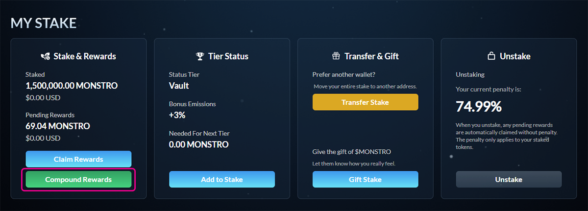

# Compounding Rewards

## Step 1: Open the Stake page

Navigate to the **Stake** page and locate the **My Stake** section showing your pending rewards.

***

## Step 2: Compound your rewards

Click **Compound Rewards** to add all pending rewards directly into your existing stake.

Your wallet will prompt you to confirm the transaction. A small amount of **ETH on Base** is required for gas.

Once confirmed, your staked amount will increase and your pending rewards will reset to zero.

<figure><figcaption></figcaption></figure>

***

### Notes

* Compounding rewards increases your total staked amount
* Compounded rewards immediately begin earning emissions
* Compounding does **not** trigger any unstaking penalties
