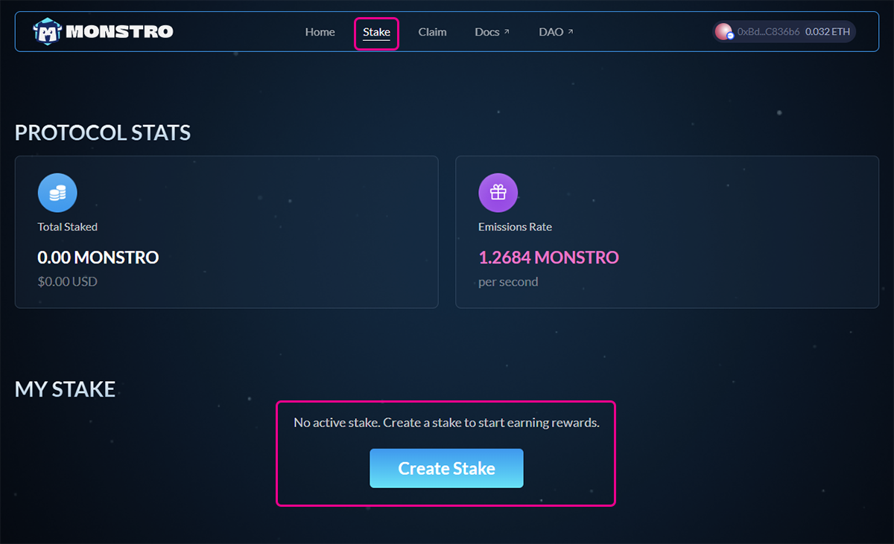
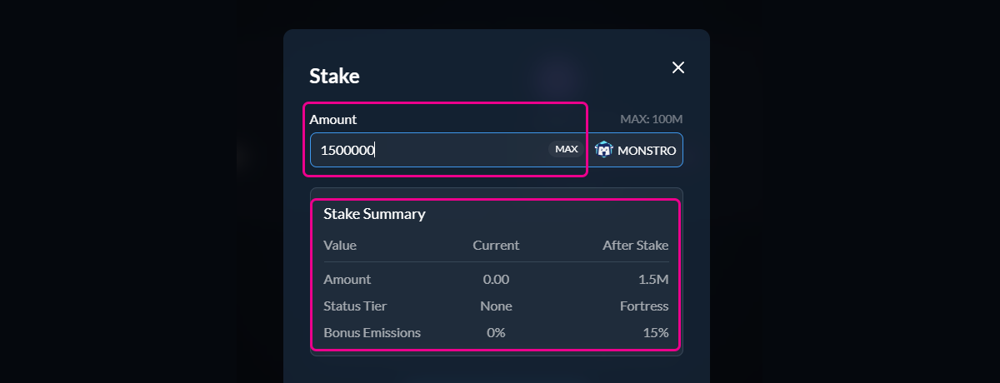
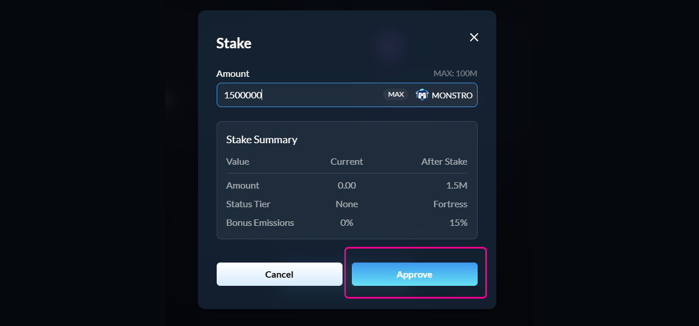
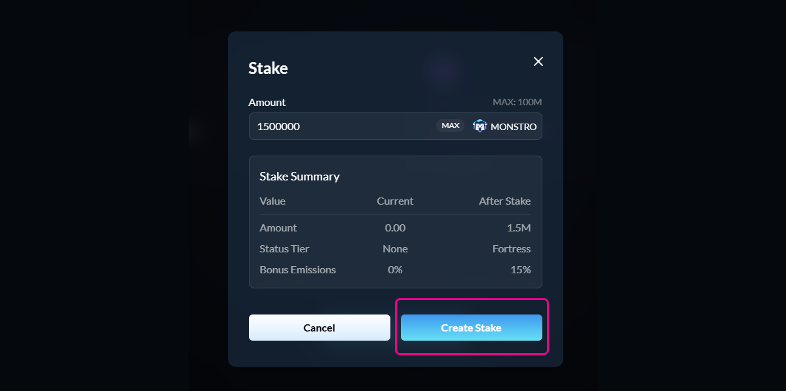
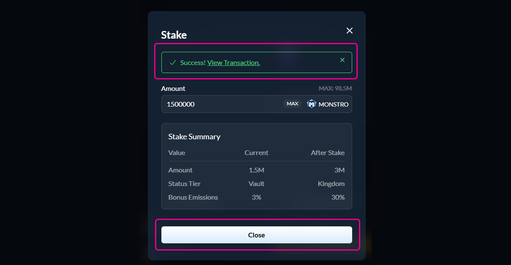

# Creating a Stake

## Step 1: Open the Stake page

Click **Stake** in the top navigation menu.

If you do not have an active stake yet, you will see a prompt to create one.

<figure><figcaption></figcaption></figure>

***

## Step 2: Enter the amount to stake

Click **Create Stake** to open the staking modal.

Enter the amount of $MONSTRO you would like to stake. The stake summary will update automatically to show:

* Your new total staked amount
* Your status tier after staking
* Any bonus emissions you unlock

<figure><figcaption></figcaption></figure>

***

## Step 3: Approve $MONSTRO (if required)

If this is your first time staking, or if you have not previously approved $MONSTRO for staking, you will be asked to approve the token.\
\
This approval allows the staking contract to access your $MONSTRO. It does not stake any tokens and only needs to be repeated if the approval is revoked.

Confirm the approval transaction in your wallet and wait for it to complete.

<figure><figcaption></figcaption></figure>

***

## Step 4: Create your stake

Once approval is complete, the button will change to **Create Stake**.

Click **Create Stake** and confirm the transaction in your wallet to finalize your stake.

<figure><figcaption></figcaption></figure>

***

## Step 5: Confirm success

After the transaction is confirmed, you will see a success message and your updated stake details.

Your $MONSTRO is now actively staked and earning rewards.

<figure><figcaption></figcaption></figure>

***

## Closing note

After creating your stake, you can return to the staking page at any time to view rewards, add more tokens, claim rewards, or manage your stake.
