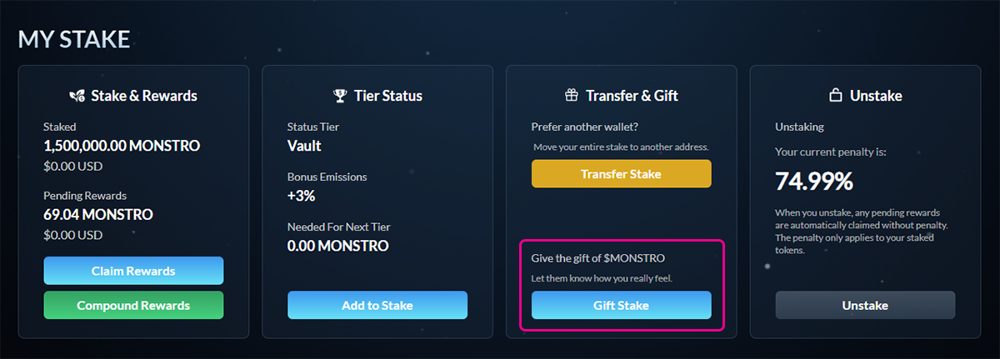
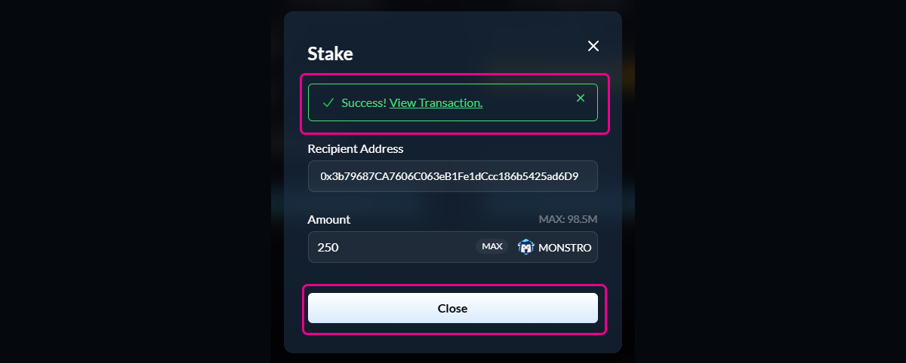

# Gifting a Stake

## What gifting does

The **Gift Stake** feature lets you send $MONSTRO to another wallet and **immediately stake it for them**.

This is useful for:

* Gifting tokens to a friend or community member
* Onboarding someone new with a staked position
* Sending staked $MONSTRO without requiring the recipient to take any action

The gifted stake:

* Belongs fully to the recipient
* Earns rewards immediately
* Follows the normal staking and penalty rules

***

## Step 1: Open the Gift option

Navigate to the **Stake** page and locate the **Transfer & Gift** section under **My Stake**.

Click **Gift Stake**.

<figure><figcaption></figcaption></figure>

***

## Step 2: Enter recipient and amount

A modal will open asking for:

* The **recipient wallet address**
* The **amount of $MONSTRO** you want to gift

Double-check the address carefully before continuing.

<figure><figcaption></figcaption></figure>

***

## Step 3: Approve $MONSTRO (if required)

If this is your first time staking, or if you have not previously approved $MONSTRO for staking, you will be asked to approve the token.\
\
This approval allows the staking contract to access your $MONSTRO. It does not transfer (gift) or stake any tokens and only needs to be repeated if the approval is revoked.

Confirm the approval transaction in your wallet and wait for it to complete.

<figure><figcaption></figcaption></figure>

***

## Step 4: Gift the stake

Once approval is complete, click **Gift Stake** and confirm the transaction in your wallet.

A small amount of **ETH on Base** is required for gas.

<figure><figcaption></figcaption></figure>

***

## Step 5: Confirm success

After the transaction is confirmed, you will see a success message.

The recipient wallet now has an active stake and can manage it from their own staking page.

<figure><figcaption></figcaption></figure>

***

## Important notes

* Gifted stakes are **created or added directly to the recipient’s stake**
* You must use **liquid (unstaked) $MONSTRO** to gift a stake
* The recipient **can already have an active stake** — the gifted amount will be added to it
* If the recipient already has a stake, the gifted tokens are added to it and the early-unstake penalty recalculates proportionally
* Once gifted, the stake is fully controlled by the recipient
* Gifting does **not** affect your own existing stake or penalties
