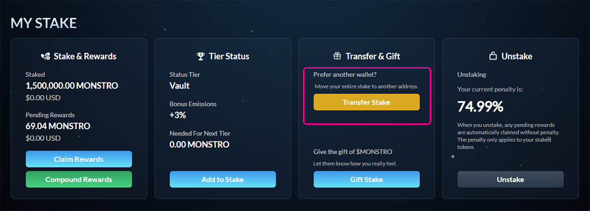

# Transferring Your Stake

## What this does

The **Transfer Stake** feature lets you move your **entire stake** to a new wallet address. This is useful if:

* You are migrating to a new wallet
* A wallet is compromised or no longer trusted
* You want to consolidate custody elsewhere

The transfer includes:

* Your full staked amount
* Any pending rewards
* Your current penalty state

This action cannot be partially performed.

***

## Step 1: Open the Transfer option

Navigate to the **Stake** page and locate the **Transfer & Gift** section under **My Stake**.

Click **Transfer Stake**.

<figure><figcaption></figcaption></figure>

***

## Step 2: Enter the recipient address

A modal will open asking for the **recipient wallet address**.

Enter the address you want to transfer your stake to. Double-check the address carefully before continuing.

<figure><figcaption></figcaption></figure>

***

## Step 3: Confirm the transfer

Click **Transfer** and confirm the transaction in your wallet. A small amount of **ETH on Base** is required for gas.

Once confirmed, the stake will be fully transferred to the recipient address.

<figure><figcaption></figcaption></figure>

***

## Important notes

* Transfers are **all or nothing** — partial transfers are not supported
* The recipient wallet **must not already have an active stake**
* The stake’s rewards and penalty state transfer along with it
* This action does **not** reset or remove penalties
